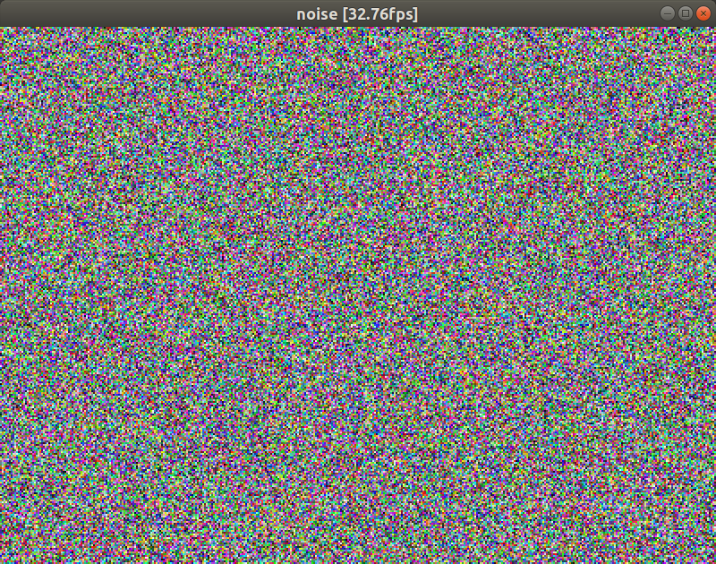
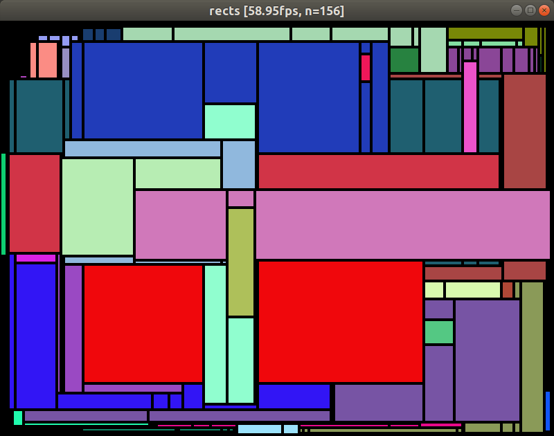

# pixels

A playground for pixel-by-pixel software rendering.

## ExampleNoise

Draw all the pixels with chaning random colors each frame.

* Press the UP and DOWN arrow keys to adjust the pixel size.

## ExampleRects

Draw random rectangles and clip them accordingly.

* Press ENTER to add a single random rectangle and perform clipping against the existing rectangles.
* Press ESC to clear all rectangles.
* Press 'B' to switch border rendering.
* Press the UP and DOWN arrow keys to adjust the pixel size.

