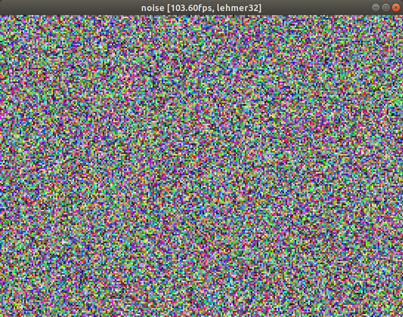
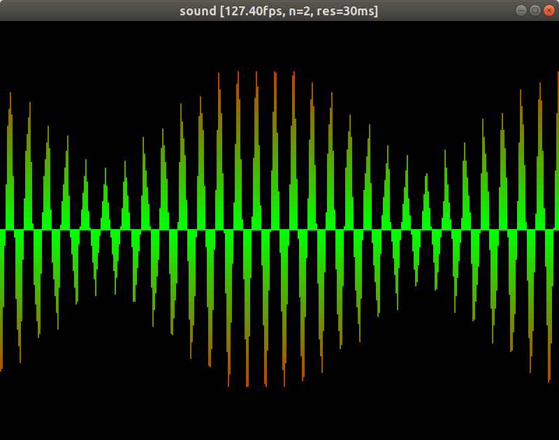

# pixels

A playground for pixel-by-pixel software rendering and simple sound synthesis.

## ExampleNoise

Draw all the pixels with random colors changing each frame.

```c++
// (main.cpp)
#include "ExampleNoise.h"

int main(int argc, char * argv[]) {
  return ExampleNoise().run(argc, argv);
}
```

* Press SPACE to change the algorithm for creating pseudo-random numbers.
* Press the UP and DOWN arrow keys to adjust the 'pixel' size.



## ExampleRects

Draw random rectangles and clip them accordingly.

```c++
// (main.cpp)
#include "ExampleRects.h"

int main(int argc, char * argv[]) {
  return ExampleRects().run(argc, argv);
}
```

* Press ENTER to add a single random rectangle and perform clipping against the existing rectangles.
* Press ESC to clear all rectangles.
* Press SPACE to switch rendering the borders of the rectangles.
* Press TAB to test for and debug overlapping pixels.
* Press the UP and DOWN arrow keys to adjust the 'pixel' size.


## ExampleSound

Play and draw semi-random sound waves.

```c++
// (main.cpp)
#include "ExampleSound.h"

int main(int argc, char * argv[]) {
  return ExampleSound().run(argc, argv);
}
```

* Press ENTER to add a semi-random sine sound wave.
* Press SPACE to add a semi-random square sound wave.
* Press TAB to add a semi-random triangle sound wave.
* Press BACKSPACE to add a semi-random sawtooth sound wave.
* Press N to add some semi-random noise.
* Press ESC to clear all sound waves.
* Press the UP and DOWN arrow keys to adjust the 'pixel' size.
* Press the RIGHT and LEFT arrow keys to adjust the resolution of the rendered sound wave.



## Requirements

On Linux, the following libraries or their substitutes need to be installed and linked against:

* [OpenGL](https://www.opengl.org/) (`libGL`)
* [GLFW](https://www.glfw.org/) (`libglfw3`)
* [X11](https://www.x.org/) (`libX11`)
* [POSIX Threads](https://en.wikipedia.org/wiki/POSIX_Threads) (`libpthread`)
* `libdl`

For using `Sound.h` and `Sound.cpp` you additionally need:

* [libsoundio](http://libsound.io/) (`libsoundio`)

Tested with `g++ (Ubuntu 7.5.0-3ubuntu1~18.04) 7.5.0`.
